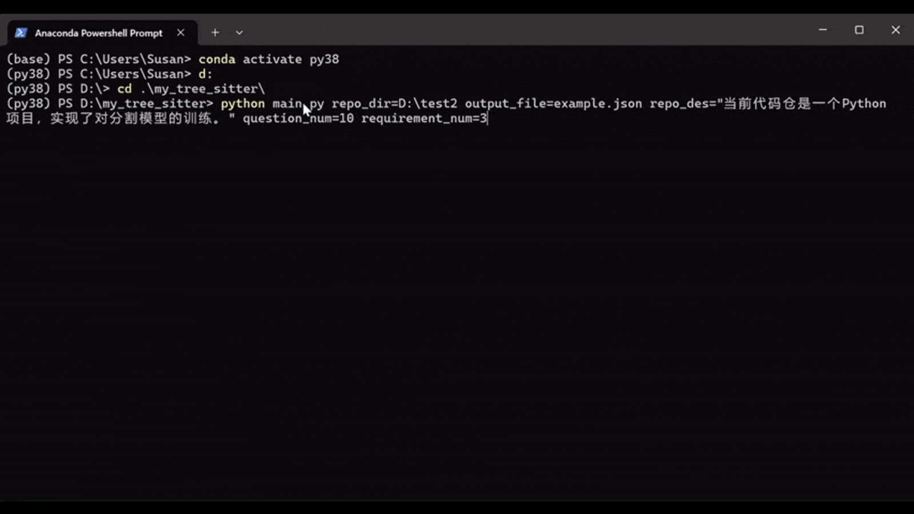
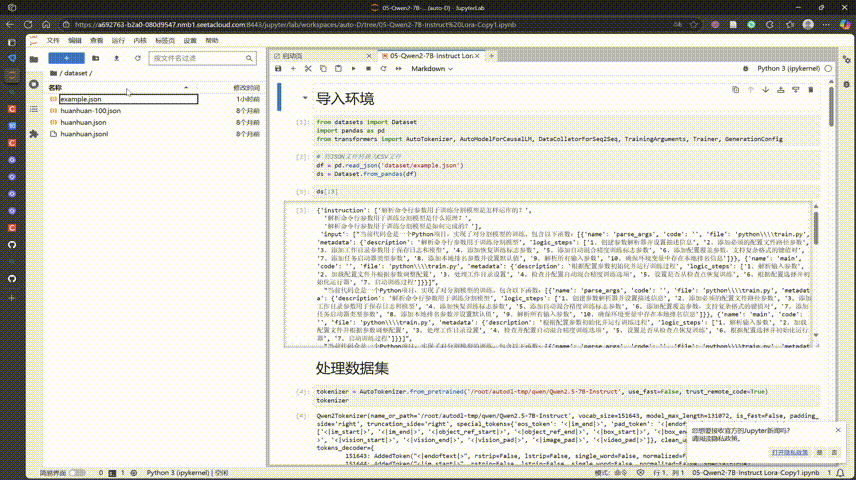

# QARepo
该repository是一个针对本地代码仓业务功能生成问答对以微调Qwen模型的工具。支持python/java/cpp三种语言。主要代码位于utils.py以及main.py中。

# 开发思路
1. 通过AST对本地代码仓中的所有函数进行解析，并调用DeepSeek的API生成函数描述和逻辑步骤，与函数名、函数代码段、函数所在文件路径一同存入字典。
2. 根据函数信息生成场景1的问题，即针对每个函数的功能描述进行提问，答案则是由上一步生成的字典中的信息组成。为了保证问题的多样性，要求DeepSeek生成n种不同的与“xx功能是如何实现的？”语义相近的问句，而每个问题的答案是相同的。
3. 根据函数信息生成场景2的问题，要求DeepSeek根据当前所有函数的信息生成n种不同的能够实现的新增功能需求描述以及对应的解决方案以及逻辑步骤，问题为“如何+生成的新增功能？”，答案为生成的解决方案以及逻辑步骤。
4. 将生成的问答对格式化存入json文件中，用于微调Qwen模型。

综上所述，为了保证生成问答对的代表性和多样性，本工具采用了以下策略：
1. 以代码仓中每个函数为最小解析单元生成场景1的问题，确保了训练数据中的问题能够全面覆盖代码仓的核心功能模块。
1. 针对场景1，使用DeepSeek的API生成n种不同含义相同句式不同的问句，以保证该场景下问题的多样性。
2. 针对场景2，使用DeepSeek的API生成多种潜在的需求，以保证该场景下问答对的多样性。

# 使用方法
1. 安装依赖库：pip install -r requirements.txt
2. 在main.py中修改DeepSeek的密钥，第17行"api_key"="your_deepseek_key"
3. 运行main.py，如： 
```python
python main.py repo_dir=D:\test2 output_file=example.json repo_des="当前代码仓是一个Python项目，实现了对分割模型的训练。" question_num=10 requirement_num=3
```
其中，repo_dir是本地代码仓的路径，output_file是生成json文件的路径，repo_des是代码仓的描述，question_num是针对场景1每个函数生成的问题数量，requirement_num是针对场景2提出的需求问题数量。这里使用了我本地构建的一个简单代码仓进行测试，生成的数据为example.json。

4. 等待生成完成，生成的问答对会以存储在output_file中，每一个问答对的格式如下：（覆盖两个场景）
```python
{
    'instruction':生成的问题,
    'input'：{
        'function_list':[func_dict1,func_dict2,...], #代码仓中所有函数信息的字典列表
        'repository_description':输入的代码仓描述
    }，#该字段会以字符串形式存储，这里为了方便展示，用字典表示
    'output':生成的答案
}
```

其中，func_dict的格式如下：
```python
{
    'name':函数名
    'code':函数代码段，
    'file':函数所在的文件路径，
    'metadata':{
        'description':函数描述，
        'logic_steps':函数逻辑步骤，
    }
}
```

# Qwen模型微调
Qwen模型的微调是在AutoDL平台上完成，使用官方镜像<https://www.codewithgpu.com/i/datawhalechina/self-llm/Qwen2.5-self-llm>，相关代码存在Qwen2-7B-Lora.ipynb中，训练使用的示例example.json也已上传。

由于算力有限，微调使用的训练数据中删除了'input'字段中的'function_list'字段的'code'字段。notebook中保留了对两种场景提问的推理答案。由于微调数据量有限，所以推理效果欠佳。

# DEMO
Step 1: Data Generating

使用本地构建的一个简单python代码仓进行测试



Step 2: Qwen Training

于AutoDL平台上完成，使用NVIDIA 4090 24G 进行训练，为了节省演示时间，这里只设置训练10个epoch



Step 3: Qwen Inference

这里借用预训练的300轮模型进行推理，可见场景1下的答案符合要求，而场景2下的答案仍欠佳，主要问题仍在于微调使用的数据量较少，模型仍欠拟合。


